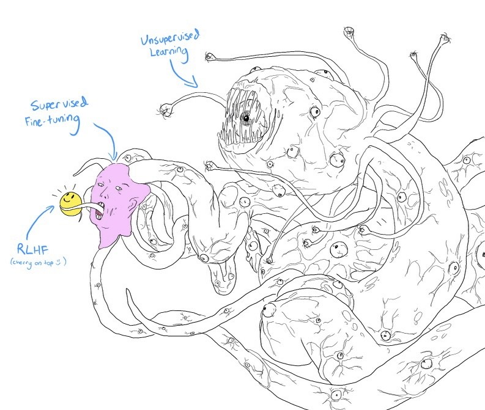

# 2. 파운데이션 모델 이해하기

- 파운데이션 모델을 학습하는 것은 매우 복잡하고 비용이 많이 듦
- 이번 장에서는 ChatGPT와 경쟁할 수 있는 모델을 만들 수 있는 방법 대신, 파운데이션 모델을 활용할 때 중요한 영향을 미치는 설계 요소들을 다룰 것
- 기밀 유지 때문에 설계 요소들을 파악하는 것조차 어렵지만, 일반적으로 학습 데이터, 모델 아키텍처, 사후 학습 방식 등이 중요함
- 특히 **학습 데이터**는 모델의 성능과 한계에 직결되므로, 이번 장에서는 학습 데이터 분포에 초점을 맞출 것
- **트랜스포머 아키텍처**에 대해서도 다룰 것
- 적절한 모델 크기를 어떻게 정할지에 대해서도 다룰 것
- 사후 학습 과정에서 **사람의 의도(human preference)** 가 갖는 모호함에 대해서도 다룰 것
- 샘플링에 대해서도 다룰 것
  - 샘플링: 모델이 선택 가능한 옵션들 중에서 어떤 것을 출력으로 선택할 것인지 결정하는 과정
  - 환각과 비일관성 등 이해하기 힘든 AI의 행동들을 설명해주는 요소
  - 적절한 샘플링 전략을 선택하면 비교적 적은 노력으로도 모델의 성능을 크게 향상시킬 수 있음

## 2.1 학습 데이터

- AI 모델은 학습한 데이터의 특성에 따라 할 수 있는 일이 정해짐
- 커먼 크롤(Common Crawl): 비영리 단체가 인터넷의 웹사이트를 주기적으로 크롤링해서 만드는 데이터셋
  - 가짜 뉴스도 많이 포함될 수 있으며, 이를 걸러내기 위한 휴리스틱 필요
- 대규모 모델 학습에는 더 많은 컴퓨팅 자원이 필요하며, 또한 고품질의 데이터 위주로 확보해야 더 뛰어난 성능을 보임

### 다국어 모델

- 커먼 크롤 데이터셋 분석 결과 영어는 전체 데이터의 거의 절반(45.88%) 차지
- 커먼 크롤에서 1% 미만을 차지하는 언어들은 대부분 AI를 학습시키기 위한 데이터가 부족하며, **저자원 언어(low-resource language)** 라고 부름
- 범용 모델이 다른 언어보다 영어에서 더 좋은 성능을 보이는 것은 당연
- LLM은 번역을 잘하니 모든 질의를 영어로 번역해서 응답을 받고 다시 원래 언어로 번역하면 되지 않을까?
  - 데이터가 적은 언어를 충분히 이해하고 번역할 수 있는 모델 필요
  - 번역 과정 중 정보 손실이 발생할 수 있음
- 영어가 아닌 언어의 모델은 품질 뿐만 아니라 지연 시간 및 비용도 많이 들 수 있음
  - 언어별로 토큰화 효율성에도 큰 차이가 존재
  - 토큰 사용량으로 비용을 청구하는 API의 경우, 다른 언어들은 영어에 비해 더 비싼 요금을 지불해야 할 수 있음
- 이를 해결하기 위해 많은 모델이 비영어권 초점으로 학습되었음
  - 가장 활발한 비영어권 모델은 중국어 모델
  - 중국어: [ChatGLM](https://github.com/zai-org/ChatGLM2-6B), [YAYI](https://github.com/wenge-research/YAYI), [Llama - Chinese](https://github.com/LlamaChinese/Llama-Chinese)
  - 한국어: [KoAlpaca](https://github.com/beomi/KoAlpaca)
  - 프랑스어: [CroissantLLM](https://huggingface.co/croissantllm)
  - 베트남어: [PhoGPT](https://github.com/VinAIResearch/PhoGPT)
  - 아랍어: [Jais](https://huggingface.co/collections/inceptionai/jais-family)

### 도메인 특화 모델

- 범용 모델들은 코딩, 법률, 과학, 비즈니스, 스포츠, 환경 등 다양한 영역에서 놀라운 성능을 보임
- 신약 발견, 암 선별 검사, 건축 스케치, 공장 설계도 등 전문적인 영역의 데이터는 구하기 어려움
- 도메인 특화 작업용 모델일수록 해당 분야의 전문적인 데이터셋 필요

## 2.2 모델링

- `<Attention Is All You Need>` 아키텍처가 언어 기반 파운데이션 모델에서 가장 널리 쓰이고 있음
  - 이 아키텍처는 트랜스포머의 성공을 가져왔음
  - 하지만 여기에도 몇 가지 한계점 존재

### seq2seq(sequence-to-sequence) 아키텍처

- 2014년 seq2seq는 기계 번역 및 요약 성능을 크게 개선했음
- 2016년 seq2seq는 구글 번역에도 도입되었음
- 이후 seq2seq는 텍스트 시퀀스를 다루는 과제에서 널리 쓰이는 아키텍처가 되었음
- seq2seq는 인코더와 디코더로 구성됨
  - 입출력 모두 토큰의 시퀀스이며, seq2seq라는 이름도 여기에서 유래했음
  - 인코더와 디코더를 RNN(순환 신경망)으로 구성
  - 인코더는 입력 토큰을 순차적으로 처리하려 입력을 표현하는 최종 은닉 상태(hidden state) 출력
  - 디코더는 인코더의 최종 은닉 상태와 이전에 생성된 토큰 기반으로 출력 토큰을 순차적으로 생성
- seq2seq의 문제점
  - 디코더는 입력의 최종 은닉 상태만 사용해 출력 토큰을 생성하므로, 마치 책 요약본만 갖고 응답을 만드는 것과 비슷함 → 생성되는 출력물의 품질 저하
  - RNN은 순차적으로 처리하므로 롱 시퀀스를 다룰 때 속도가 느려짐

### 트랜스포머 아키텍처

- 트랜스포머 아키텍처는 어텐션 메커니즘으로 seq2seq의 문제점들을 해결함
  - 어텐션 메커니즘을 통해 모델은 각 출력 토큰 생성 시 입력 토큰의 중요도에 가중치를 둘 수 있음
- RNN 없이 설계되었음
- 입력 토큰 병렬 처리 가능 → 입력 처리 속도 향상
- 하지만 트랜스포머 기반의 자기회귀 언어 모델은 여전히 순차 출력의 병목 현상이 남아 있음
  - 자기 회귀 모델은 한 토큰씩 순차적으로 예측해서 생성하는 방식이기 때문
- 트랜스포머 기반 언어 모델의 추론 단계
  - Prefill: 모델이 입력 토큰을 **병렬**로 처리, 첫 출력 토큰 생성에 필요한 중간 상태를 만듦, 각 입력 토큰의 키 벡터 및 값 벡터가 중간 상태에 저장됨
  - Decode: 모델이 출력 토큰을 **순차적**으로 생성

**어텐션 메커니즘**

- 트랜스포머 아키텍처의 핵심
- 내부적으로 **key, value, query vector** 활용
  - Q: 각 디코딩 단계에서 디코딩의 현재 상태를 나타냄
  - K: 이전 토큰을 나타냄, 특정 디코딩 단계에서는 입력 토큰 및 이미 생성된 토큰이 포함된다는 점이 중요
  - V: 모델이 학습한 이전 토큰의 실제 값
- 쿼리 벡터와 키 벡터 간의 **내적(dot product)** 을 통해 각 입력 토큰의 중요도 계산
- 이전 토큰마다 키 벡터 및 값 벡터가 있기 때문에 시퀀스가 길어질수록 더 많은 키 벡터 및 값 벡터를 계산하고 저장해야 함
- 쿼리, 키, 값 행렬의 차원은 모델의 은닉 차원에 해당함
- 어텐션 메커니즘은 대부분 **멀티헤드**로 구현됨
  - 멀티헤드 사용 시 모델이 서로 다른 이전 토큰 그룹들을 병렬로 어텐션할 수 있음
  - 멀티헤드 어텐션은 쿼리, 키, 값 벡터가 더 작은 벡터들로 나뉘어 하나의 **어텐션 헤드**에 할당됨
  - 모든 어텐션 헤드의 출력은 이어 붙여짐
  - 이어 붙여진 벡터는 선형 변환을 거쳐 최종 출력 벡터 생성
  - 출력 투영 행렬은 모델의 은닉 차원과 같은 크기를 가짐

**트랜스포머 블록**

- 트랜스포머 아키텍처는 여러 개의 트랜스포머 블록으로 구성됨
- 블록의 정확한 내용은 모델마다 다르지만, 일반적으로 **Multi-Head Attention(MHA)** 모듈과 **Multi-Layer Perceptron(MLP)** 모듈을 포함
  - 어텐션 모듈: 쿼리, 키, 값, 출력 투영이라는 4개 가중치 행렬로 구성됨
  - MLP 모듈: **비선형 활성화 함수**로 구분된 선형 레이어들로 구성됨
    - 각 선형 레이어는 선형 변환에 사용되는 가중치 행렬
    - 활성화 함수는 선형 레이어가 비선형 패턴을 학습할 수 있게 해줌
    - 선형 레이어는 피드포워드 레이어라고도 불림
- 트랜스포머 모델의 트랜스포머 블록 수는 흔히 해당 모델의 레이어 수로 불림
- 트랜스포머 기반 언어 모델은 모든 트랜스포머 블록 앞뒤에 모듈을 갖추고 있음
  - **블록 이전의 임베딩 모듈**
    - 토큰을 임베딩 벡터로 변환하는 임베딩 행렬과 토큰 위치를 임베딩 벡터로 변환하는 위치 임베딩 행렬로 구성됨
    - 최종적으로 두 벡터를 합산
    - 단순히 보면 위치 색인의 수가 모델 최대 컨텍스트 길이를 결정함
    - 하지만 위치 색인의 수를 늘리지 않고 모델 컨텍스트 길이를 늘릴 수 있는 기법들이 있음
  - **블록 이후의 출력 레이어**
    - 모델의 출력 벡터를 모델 출력을 샘플링하는 데 사용되는 토큰 확률로 매핑
    - 일반적으로 un-embedding 레이어라고 하는 하나의 행렬로 구성됨
    - 출력 생성 전 모델의 마지막 레이어이므로 모델 헤드라고도 불림

### compute-optimal model

- 고정된 컴퓨팅 예산 내에서 최고 성능을 달성할 수 있는 모델을 **컴퓨팅-최적 모델**이라고 부름
- **친칠라 스케일링 법칙(Chinchilla scaling law)** : 컴퓨팅 예산 내에서 최적의 모델 크기와 데이터셋 크기를 계산하는 규칙
  - 특정 모델 성능을 달성하는 비용은 지속적으로 감소하고 있음
  - 같은 모델 성능 달성 비용은 감소하고 있지만, 모델 성능 향상 비용은 여전히 높음

### 스케일링 외삽 (Scaling extrapolation)

- 모델의 성능은 하이퍼파라미터 값에 크게 좌우됨
  - 파라미터: 모델에 의해 학습되는 값
  - 하이퍼파라미터: 모델을 구성하고 모델의 학습 방식을 제어하기 위해 설정하는 값
    - 모델을 구성하는 하이퍼파라미터: 레이어 수, 모델 차원, 어휘 크기 등
    - 모델의 학습 방식을 제어하는 하이퍼파라미터: 배치 크기, 에포크 수, 학습률, 레이어별 초기 분산 등
- 작은 모델을 다룰 때 서로 다른 하이퍼파라미터 집합으로 모델을 여러 번 학습하고 가장 좋은 성능을 보이는 것을 고르는 게 일반적
- 하지만 큰 모델은 한 번 학습만으로도 자원을 많이 소모하기 때문에 이 방식을 사용하기 어려움
- 따라서 대규모 모델에서는 어떤 하이퍼파라미터가 최상의 성능을 낼지 예측하는 연구 분야가 생겼음
  - [하이퍼파라미터 작동 여부에 대한 시각화](https://x.com/jaschasd/status/1756930242965606582)

### 스케일링 병목 현상

- GPT-1 (1억 1,700만 파라미터) → GPT-2 (15억 파라미터) → GPT-3 (1,750억 파라미터)
- 2018년부터 2021년까지 모델 크기가 1,000배 증가했음
- 모델 크기는 앞으로도 계속 커질 수 있는가? → 답변하기 어렵지만 2가지 병목 현상이 나타나고 있음
- **데이터 문제**
  - 파운데이션 모델은 수많은 데이터를 사용하기 때문에 몇 년 안에 인터넷 데이터가 부족해질 수 있음
  - 학습 데이터셋 크기의 증가율이 새로 생성되는 데이터의 증가율보다 훨씬 빨라졌음
  - 인터넷에 AI 모델이 생성한 데이터들이 늘어나고 있으므로, 새로운 모델은 부분적으로 AI가 생성한 데이터로 학습될 것
  - 공개된 데이터가 소진되면 독점 데이터 활용을 위해 노력하게 될 것
- **전기 문제**
  - 현재 데이터 센터는 전 세계 전기의 1-2% 소비 중 → 2030년에는 4-20% 사이에 도달할 것으로 예상됨
  - 더 나은 에너지 생산 방법을 찾지 못한다면 데이터 센터는 최대 50배까지만 성장 가능
  - 전기 비용이 상승할 수도 있음

## 2.3 사후 학습

- 사전 학습 모델의 2가지 문제
  - 자기 지도 학습은 모델이 대화보다는 텍스트 완성을 잘하도록 학습하게 됨 (*"사람이 아닌 웹 페이지처럼 말한다"*)
  - 인터넷에서 무차별적으로 데이터를 수집하면 무례하거나 차별적이거나 틀린 답을 내놓게 될 수 있음
- 사후 학습의 목표는 위 문제들을 모두 해결하는 것
- 사후 학습의 일반적인 2단계
  - **지도 파인튜닝(Supervised Fine-Tuning, SFT)** : 고품질 지시 데이터로 파인튜닝
  - **선호도 파인튜닝(Preference Fine-Tuning)** : 인간의 선호도를 학습, 일반적으로 강화 학습(RL)으로 수행됨
- 사전 학습은 다음 토큰을 정확히 예측하게 해서 **토큰 단위의 품질**을 높임 / 사후 학습은 **전체 응답의 품질**을 높임
  - 사후 학습은 일반적으로 사용자가 선호하는 응답을 생성하도록 모델을 최적화
  - 사전 학습이 지식을 습득하기 위한 독서라면, 사후 학습은 그 지식을 사용하는 법을 배우는 것
- 사후 학습은 사전 학습에 비해 적은 양의 자원 소비 (InstructGPT - 사전 학습 98% / 사후 학습 2%)
- 사후 학습은 프롬프트로는 활용하기 어려운 능력을 더 이끌어내는 과정이라고 볼 수 있음

**RLHF (Reinforcement Learning from Human Feedback)**



1. **자기 지도 사전 학습**은 인터넷에서 무작위로 가져온 데이터들로 인해 괴물 같이 제멋대로인 모델을 만듦
2. 더 높은 품질의 데이터로 **지도 파인튜닝**을 거쳐 사회적으로 더 수용 가능한 상태로 만듦
3. **선호도 파인튜닝**을 통해 인간에게 친숙한 상태가 되도록 만들어짐

### 지도 파인튜닝 (Supervised Fine-Tuning, SFT)

- 시연 데이터(demonstration data): 프롬프트-응답 쌍으로 구성된 데이터셋
  - 모델의 행동 양식을 보여주기 때문에 "행동 복제"라고도 부름
  - 시연 데이터에는 비판적 사고, 정보 수집, 사용자 요청의 적절성 등에 대해 판단이 필요한 복잡한 프롬프트가 포함될 수 있음
  - 기업들은 데모 데이터 생성을 위해 보통 고학력 레이블러를 고용함

### 선호도 파인튜닝 (Preference Fine-Tuning)

- 시연 데이터는 모델에게 대화하는 법을 가르치지만, 어떤 종류의 대화를 해야 하는지는 가르치지 않음
- 모델이 논란이 되는 문제에 대해 응답하든, 혹은 너무 검열하든 양쪽 다 문제가 될 수 있음
- 선호도 파인튜닝의 목표: AI 모델이 사람의 선호도에 따라 행동하도록 만드는 것
  - 보편적인 사람의 선호도가 존재한다고 가정할 뿐만 아니라, 그것을 AI에 내장할 수 있다고 가정하기 때문에 굉장히 어려운 도전과제
- RLHF의 구성 방식
  - 파운데이션의 모델의 출력에 점수를 매기는 보상 모델을 학습
  - 보상 모델이 최대 점수를 줄 응답을 생성하도록 파운데이션 모델 최적화

**보상 모델**

- 프롬프트-응답 쌍이 주어지면 해당 응답이 얼마나 좋은지 점수를 매김
- **pointwise evaluation**: 각 샘플을 독립적으로 평가
  - 레이블러가 두 응답을 비교하는 방식보다 더 어려움
  - 각 프롬프트에 대해 사람이나 AI가 여러 응답을 생성하고, 결과 레이블 데이터는 '프롬프트-선호 응답-비선호 응답' 형식이 됨
  - 좋은 응답의 기준은 사람마다 다르고 수학적 공식으로 표현하기 어려움
- 비교 데이터로 모델이 구체적인 점수를 매기도록 학습하려면 알맞은 목적 함수를 설계해야 할 것
  - 선호 응답과 비선호 응답의 출력 점수 차이를 나타내는 방식이며, 이 차이를 최대화하는 것이 목표
- 보상 모델도 결국 강력한 파운데이션 모델 기반으로 파인튜닝할 때 최고의 결과를 낼 수 있음

## 2.4 샘플링

- 모델은 샘플링 과정을 통해 출력 생성
- **temperature**, **top-k**, **top-p** 등 다양한 샘플링 전략 및 변수가 있음
- 이번 절에서 여러 출력을 샘플링해서 모델의 성능을 향상시키는 방법을 알아볼 것
- 특정 형식 및 제약 조건에 따르는 응답을 생성하도록 샘플링 과정을 수정하는 방법도 알아볼 것
- 샘플링은 AI의 출력을 확률적으로 만듦
  - 확률적 특성을 이해하는 것은 비일관성, 환각 등의 문제를 다루는 데 중요함
- 입력이 주어지면 신경망은 잠재적 결과들의 확률을 먼저 계산해 출력을 생성
  - 분류 모델의 잠재적 출력은 모델이 분류할 수 있는 클래스
  - 예를 들어, 이메일이 스팸인지 아닌지 분류하는 모델은 '스팸'과 '스팸 아님'이라는 두 가지 클래스의 확률을 계산
- 그리디 샘플링: 잠재적 결과들의 확률이 서로 다를 때 가장 높은 확률을 가진 결과를 선택하는 것
  - 분류 작업에서 잘 동작하는 편이지만, 언어 모델의 경우 지루한 출력을 만들어냄 (어떤 질의를 하든 가장 흔한 단어로 응답하기 때문)
- 신경망은 입력이 주어졌을 때 **로짓 벡터** 출력
  - 각 로짓은 하나의 잠재적인 값을 나타냄
  - 언어 모델에서 각 로짓은 모델 어휘집에 있는 하나의 토큰을 나타냄
  - 로짓 벡터의 크기는 어휘집의 크기와 같음
  - 더 큰 로짓이 더 높은 확률에 대응하지만, 로짓이 확률을 나타내는 것은 아님 → 즉, 로짓의 합은 1을 넘지 못함
  - 확률은 음수가 될 수 없지만, 로짓은 음수가 될 수도 있음
  - 로짓을 확률로 변환하기 위해 softmax 레이어가 자주 사용됨

### Temperature

- 더 높은 온도는 흔한 토큰의 확률을 줄이고, 희귀한 토큰의 확률을 증가시킴 → 모델의 창의성 증진
- 온도는 softmax 변환 전 로짓을 조정하는 데 사용되는 상수
- 조정된 로짓은 로짓을 온도로 나눈 값에 softmax를 적용하여 계산됨
- 온도가 높을수록 모델이 가장 명백한 값(가장 높은 로직)을 선택할 가능성이 낮아지고, 모델의 출력이 창의적이게 됨
- 온도가 낮을수록 모델이 가장 명백한 값을 선택할 가능성이 높아지고, 모델의 출력이 일관적이게 되지만 더 지루해질 수 있음
- 모델 제공업체들은 일반적으로 온도를 0과 2 사이로 제한
  - 온도 0.7은 종종 창의적인 활용 사례에 추천됨 (창의성과 예측 가능성의 균형)

**logprob (log probability)**

- [OpenAI Developers - Using logprobs](https://developers.openai.com/cookbook/examples/using_logprobs)
- 모델 제공업체들은 모델이 생성한 확률을 logprob으로 제공
- logprob은 로그 스케일로 표현된 확률이며, 로그 스케일은 underflow 문제를 줄여주기 때문에 선호됨
  - underflow 문제: 숫자가 너무 작아서 0으로 내림되는 경우에 발생
- 애플리케이션 개발(특히 분류), 애플리케이션 평가, 모델 내부 작동 방식 이해에 유용함
- 하지만 많은 모델 제공자들이 보안상의 이유로 logprob API를 제한하고 있음

### top-k

- 모델의 응답 다양성을 지나치게 희생하지 않으면서 계산 작업량을 줄이기 위한 샘플링 전략
- 모델이 로짓 계산 후 상위 k개 로짓 선택하고, 이 k개 로짓에 대해서만 softmax 수행
- k는 50에서 500 사이 정도이며, 모델의 어휘 크기보다 훨씬 작은 수치
- k 값이 작아지면 모델이 선택할 수 있는 단어 수도 줄어들기 때문에 예측 가능하지만 덜 흥미롭게 됨

### top-p

- nucleus sampling이라고도 알려짐
- 샘플링할 값을 동적으로 선택하는 방식
- 모델은 가장 가능성이 높은 다음 값 확률을 내림차순으로 합산하고, 합이 p에 도달하면 중단
- top-p 샘플링의 일반적인 값은 보통 0.9에서 0.95 사이
  - top-p 값이 0.9라는 것은 모델이 누적 확률 90%를 초과하는 최소한의 단어들만 고려하여 후속 단어를 선택한다는 의미
- top-k와 달리 top-p는 softmax 계산 부하를 반드시 줄여주지는 못함
- top-p는 컨텍스트와 관련이 높은 단어들만 후보로 삼기에, 컨텍스트에 적절한 문장을 생성할 수 있음

### 중단 조건

- 긴 출력 시퀀스는 더 많은 시간 및 비용이 들기 때문에 모델이 시퀀스 생성을 중단하는 조건을 설정
- 가장 간단한 방법: 모델이 일정 개수의 토큰 생성 후 자동으로 멈추게 하기
  - 단점: 출력이 문장 중간에 잘릴 가능성 존재
- 더 나은 방법: 중단 토큰이나 중단 단어를 사용하는 방법
  - 시퀀스 종료 토큰을 만나면 생성을 중단하도록 하는 방식
  - 이러한 중단 조건으로 지연 시간 및 비용을 낮게 유지할 수 있음
  - 단점: 원하는 출력 형식이 있는 경우, 조기 중단으로 인해 출력 형식에 문제가 생길 수 있음

### Test Time Compute

- 모델이 전체 출력을 샘플링하는 간단한 방법
- 질의당 하나의 응답이 아닌, 여러 응답을 생성해 좋은 응답이 나올 확률을 높임
- best of N 기법으로 여러 출력을 무작위로 생성하고 가장 적합한 출력 선택
- 무작위 생성 대신 Beam search를 활용해서 시퀀스 생성 단계마다 가장 가능성이 높은 후보(beam)들을 정해진 개수만큼 생성할 수도 있음
- Test Time Compute의 효과를 높이기 위해서는 출력의 다양성을 높여야 함
  - 그러기 위해 모델의 샘플링 변수를 변경하는 것이 좋은 방법
- 언어 모델의 출력은 토큰의 시퀀스이며, 각 토큰은 모델이 계산한 확률, 출력의 확률은 출력의 모든 토큰의 확률을 곱한 값

```js
p(I love food) = p(I) * p(love | I) * p(food | I,love)
```

- 토큰 시퀀스의 logprob은 시퀀스의 모든 토큰의 logprob의 합

```js
logprob(I love food) = logprob(I) + logprob(love | I) + logprob(food | I,love)
```

- 숏 시퀀스에 대한 편향을 피하기 위해 시퀀스의 합을 길이로 나눠 평균 logprob을 사용할 수 있음
  - 여러 출력을 샘플링한 후 평균 logprob이 가장 높은 것 선택
  - OpenAI API의 방식
- 다른 방식은 보상 모델로 각 출력의 점수를 매기는 방식
  - 스티치, 픽스, 그랩의 방식
